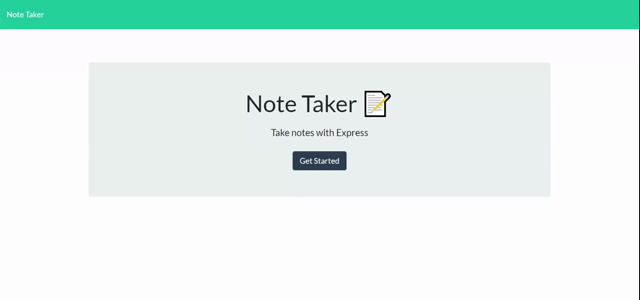

# Note Taker
  [](https://opensource.org/licenses/ISC)
  ## Description
  Express Note Taker is a simple application that allows a user to easily write and save notes and save them on their own localhost server.
  ## Table of Contents
  * [Installation](##-installation)
  * [Usage](##-usage)
  * [Demo](##-demo)
  * [Questions](##-questions)
  ## Installation
  To install the necessary dependencies, run the following command:
  ```
  npm i
  npm i express
  
  ```
  ## Usage
  After installation, locate the application in your terminal, run 'node server.js' to start the local server. In your browser's url, enter 'http://localhost:3000/' to connect to your localhost server and load the note taker applicatiogitn.

  ## Demo
  <a href="https://fast-sierra-79700.herokuapp.com/">Heroku Link</a>
  
  ## License
  This projects is licensed under the ISC license.
  ## Questions
  If you have any questions about the repo, open an issue or contact me directly at [jimmy.antley@gmail.com](mailto:jimmy.antley@gmail.com). You can find more of my work at [Jimmant91](https://www.github.com/Jimmant91).